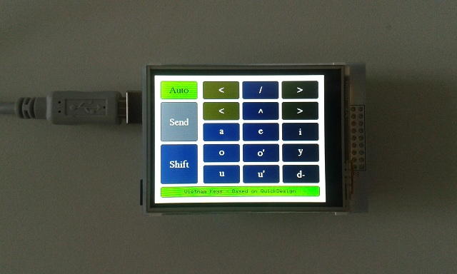
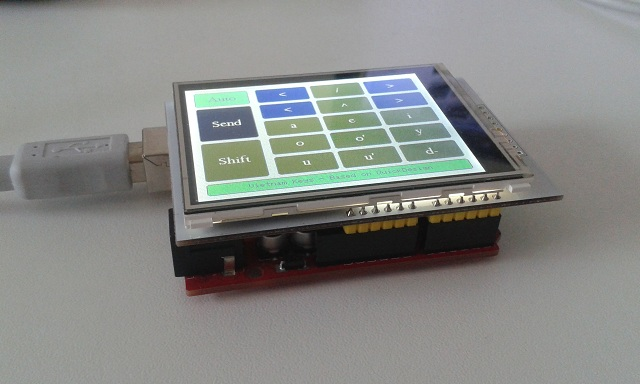

# vietnam-keys
Arduino as Keyboard for Vietnamese Special Characters

**Prerequisites:**
- Arduino UNO or MEGA2560
- Display shield 320x240 Colour-TFT-LCD with Touch for Arduino, e.g Iduino TF028

**Project Idea:**
- The Vietnamese language uses a lot of special characters not available on a non-Vietnamese keyboard.
- The Arduino can be used as a keyboard extension for a standard keyboard - i.e. as a second keyboard for the Vietnamese characters (both standard keyboard and Arduino being used simultaneously).

**Strategy:**
- The Arduino USB interface chip has to be reprogrammed, so that the host computer recognizes it as a HID keyboard device
- The special Vietnamese characters are sent to the host computer as ALT codes

The Arduino GUI:

The display shield plugs directly onto the Arduino:

